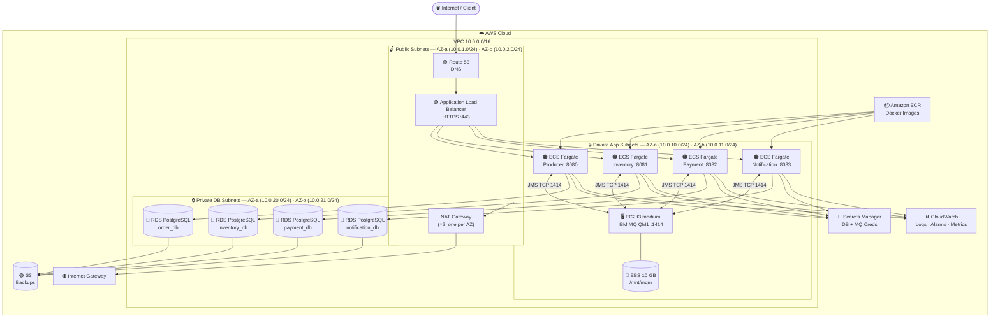

# ECS Fargate + RDS Architecture
## IBM MQ Order Saga Microservices

---

## Architecture Diagram


---

## Mermaid Diagram



---

## What Each Component Does

| Component | Why It's Here |
|---|---|
| **Route 53** | DNS routing — maps your domain to the ALB |
| **ALB (Application Load Balancer)** | HTTPS termination, routes `/api/producer/*` → Producer, etc. Health checks per service |
| **NAT Gateway (×2)** | Fargate tasks in private subnets need internet to pull ECR images and call AWS APIs |
| **ECS Fargate — 4 tasks** | Runs all 4 Spring Boot services as serverless containers — no EC2 management |
| **EC2 t3.medium — IBM MQ** | IBM MQ needs persistent disk (`/mnt/mqm`); no AWS-managed equivalent exists |
| **EBS 10 GB gp3** | Stores IBM MQ queue data — survives EC2 reboots |
| **RDS PostgreSQL (×4)** | Managed databases — automated backups, Multi-AZ option, zero patching |
| **ECR** | Docker image registry — Fargate pulls images from here at task startup |
| **Secrets Manager** | Stores DB passwords + MQ credentials; injected into ECS tasks at runtime |
| **CloudWatch** | Container logs, CPU/memory alarms, custom MQ queue depth metrics |
| **S3** | RDS automated backup storage (managed by AWS), optional DB snapshot archive |
| **IAM** | Task execution roles + task roles with least-privilege policies |

---

## VPC & Network Design

```
VPC: 10.0.0.0/16
│
├─── AZ-a (ap-south-1a)
│     ├── Public Subnet:      10.0.1.0/24   [ALB node, NAT Gateway A]
│     ├── Private App Subnet: 10.0.10.0/24  [ECS Fargate tasks, EC2 IBM MQ]
│     └── Private DB Subnet:  10.0.20.0/24  [RDS Primary nodes]
│
└─── AZ-b (ap-south-1b)
      ├── Public Subnet:      10.0.2.0/24   [ALB node, NAT Gateway B]
      ├── Private App Subnet: 10.0.11.0/24  [ECS Fargate tasks (spread)]
      └── Private DB Subnet:  10.0.21.0/24  [RDS Standby (Multi-AZ) / free tier: skip]
```

### Security Groups

| Security Group | Inbound | Outbound | Purpose |
|---|---|---|---|
| `sg-alb` | 443 from `0.0.0.0/0`, 80 from `0.0.0.0/0` (redirect) | All to `sg-ecs-*` | Public-facing HTTPS |
| `sg-ecs-producer` | 8080 from `sg-alb` | 1414 to `sg-mq`, 5432 to `sg-rds-producer`, 443 to `0.0.0.0/0` (AWS APIs) | Producer service |
| `sg-ecs-inventory` | 8081 from `sg-alb` | 1414 to `sg-mq`, 5432 to `sg-rds-inventory`, 443 to `0.0.0.0/0` | Inventory service |
| `sg-ecs-payment` | 8082 from `sg-alb` | 1414 to `sg-mq`, 5432 to `sg-rds-payment`, 443 to `0.0.0.0/0` | Payment service |
| `sg-ecs-notification` | 8083 from `sg-alb` | 1414 to `sg-mq`, 5432 to `sg-rds-notification`, 443 to `0.0.0.0/0` | Notification service |
| `sg-mq` | 1414 from `sg-ecs-*`, 9443 from `YOUR_IP/32` | None outbound needed | IBM MQ broker |
| `sg-rds-producer` | 5432 from `sg-ecs-producer` only | None | order_db — isolated |
| `sg-rds-inventory` | 5432 from `sg-ecs-inventory` only | None | inventory_db — isolated |
| `sg-rds-payment` | 5432 from `sg-ecs-payment` only | None | payment_db — isolated |
| `sg-rds-notification` | 5432 from `sg-ecs-notification` only | None | notification_db — isolated |

> **Key security principle**: Each RDS instance is reachable by exactly one ECS service.
> This enforces the Database-per-Service pattern at the AWS network level.

---

## ECS Fargate Configuration

### Cluster

```
Cluster Name: order-saga-cluster
Capacity Provider: FARGATE (+ FARGATE_SPOT for dev/cost saving)
Container Insights: Enabled
```

### Task Definition Template (Producer Service)

```json
{
  "family": "order-producer-service",
  "networkMode": "awsvpc",
  "requiresCompatibilities": ["FARGATE"],
  "cpu": "512",
  "memory": "1024",
  "executionRoleArn": "arn:aws:iam::ACCOUNT:role/ecs-task-execution-role",
  "taskRoleArn": "arn:aws:iam::ACCOUNT:role/ecs-producer-task-role",
  "containerDefinitions": [
    {
      "name": "order-producer-service",
      "image": "ACCOUNT.dkr.ecr.REGION.amazonaws.com/order-producer-service:latest",
      "portMappings": [{"containerPort": 8080, "protocol": "tcp"}],
      "environment": [
        {"name": "MQ_HOST",  "value": "10.0.10.XXX"},
        {"name": "DB_HOST",  "value": "order-producer-db.cluster.REGION.rds.amazonaws.com"},
        {"name": "DB_PORT",  "value": "5432"}
      ],
      "secrets": [
        {"name": "MQ_PASSWORD",         "valueFrom": "arn:aws:secretsmanager:REGION:ACCOUNT:secret:order-saga/mq-password"},
        {"name": "POSTGRES_PASSWORD",   "valueFrom": "arn:aws:secretsmanager:REGION:ACCOUNT:secret:order-saga/db-password"},
        {"name": "POSTGRES_USER",       "valueFrom": "arn:aws:secretsmanager:REGION:ACCOUNT:secret:order-saga/db-user"}
      ],
      "logConfiguration": {
        "logDriver": "awslogs",
        "options": {
          "awslogs-group": "/ecs/order-producer-service",
          "awslogs-region": "ap-south-1",
          "awslogs-stream-prefix": "ecs"
        }
      },
      "healthCheck": {
        "command": ["CMD-SHELL", "curl -f http://localhost:8080/api/producer/health || exit 1"],
        "interval": 30,
        "timeout": 5,
        "retries": 3,
        "startPeriod": 60
      }
    }
  ]
}
```

### Task Sizes (all 4 services)

| Service | CPU | Memory | Why |
|---|---|---|---|
| order-producer-service | 512 (0.5 vCPU) | 1024 MB | Spring Boot + REST + OutboxPoller |
| order-inventory-service | 512 (0.5 vCPU) | 1024 MB | Spring Boot + JMS listener + catalog |
| order-payment-service | 256 (0.25 vCPU) | 512 MB | Lightest service — simple payment logic |
| order-notification-service | 256 (0.25 vCPU) | 512 MB | Simple notification persistence |

### ECS Services

```
Service: order-producer-service
  Task Definition: order-producer-service:latest
  Desired Count: 1 (scale to 2+ for production)
  Launch Type: FARGATE
  Subnets: private-app-a, private-app-b
  Security Group: sg-ecs-producer
  Load Balancer: ALB → target group → port 8080
  Health Check Grace Period: 60s
  Deployment: Rolling (min 50%, max 200%)
```

Same pattern for all 4 services — only port and target group change.

---

## RDS Configuration

### Instance Specs

| Database | Instance | Storage | Multi-AZ | Monthly Cost |
|---|---|---|---|---|
| order_db | db.t3.micro | 20 GB gp3 | ❌ (POC) | ~$15/mo |
| inventory_db | db.t3.micro | 20 GB gp3 | ❌ (POC) | ~$15/mo |
| payment_db | db.t3.micro | 20 GB gp3 | ❌ (POC) | ~$15/mo |
| notification_db | db.t3.micro | 20 GB gp3 | ❌ (POC) | ~$15/mo |
| **Total** | | **80 GB** | | **~$60/mo** |

> Enable Multi-AZ before production traffic — adds ~$15/mo per instance.

### RDS Settings

```
Engine:              PostgreSQL 15
Engine Version:      15.x (latest minor)
Backup Retention:    7 days (POC), 35 days (production)
Backup Window:       02:00–03:00 UTC
Maintenance Window:  Sunday 03:00–04:00 UTC
Encryption:          AES-256 (AWS KMS) — enabled
Auto Minor Upgrade:  Yes
Deletion Protection: Yes (production)
Publicly Accessible: No (private subnet only)
```

### RDS Subnet Group

```
DB Subnet Group: order-saga-db-subnets
  Subnets: private-db-a (10.0.20.0/24)
           private-db-b (10.0.21.0/24)
```

---

## IBM MQ on EC2

IBM MQ **cannot** be replaced by any AWS-managed service for this codebase without code changes.

```
Instance:     EC2 t3.medium (2 vCPU, 4 GB RAM)
OS:           Amazon Linux 2023
EBS root:     20 GB gp3 (OS + Docker)
EBS data:     10 GB gp3 mounted at /mnt/mqm (IBM MQ queue persistence)
Security:     sg-mq (only ECS tasks can reach port 1414)
IAM:          ec2-mq-role (CloudWatch logs only)
Docker run:   IBM MQ container with /mnt/mqm bind-mounted to EBS
```

```bash
# IBM MQ startup on EC2
docker run -d \
  --name ibm-mq \
  --restart unless-stopped \
  -e LICENSE=accept \
  -e MQ_QMGR_NAME=QM1 \
  -e MQ_APP_PASSWORD=$MQ_PASSWORD \
  -e MQ_ADMIN_PASSWORD=$MQ_ADMIN_PASSWORD \
  -p 1414:1414 \
  -p 9443:9443 \
  -v /mnt/mqm:/mnt/mqm \
  -v /home/ec2-user/mq-config/20-queues.mqsc:/etc/mqm/20-queues.mqsc:ro \
  icr.io/ibm-messaging/mq:latest
```

---

## Cost Breakdown

### Fargate + RDS Architecture (~$130–165/month)

| Service | Spec | Daily | Monthly | Notes |
|---|---|---|---|---|
| **ECS Fargate** | 4 tasks: 2× (0.5vCPU/1GB) + 2× (0.25vCPU/0.5GB) | ~$1.70 | ~$51 | 24/7 running |
| **EC2 t3.medium** (IBM MQ) | On-Demand | ~$1.04 | ~$30 | Reserved = ~$18/mo |
| **EBS gp3 30 GB** | Root + IBM MQ data | ~$0.08 | ~$2.40 | — |
| **RDS t3.micro × 4** | 20 GB gp3, no Multi-AZ | ~$2.00 | ~$60 | Add Multi-AZ = +$60/mo |
| **ALB** | 1 load balancer | ~$0.53 | ~$16 | Per-LCU charges on top |
| **NAT Gateway × 2** | One per AZ | ~$2.13 | ~$64 | Biggest non-compute cost |
| **ECR** | < 500 MB images | $0 | $0 | Free tier 500 MB |
| **Secrets Manager** | 5 secrets | ~$0.07 | ~$2 | $0.40/secret/mo |
| **CloudWatch Logs** | < 5 GB/mo | $0 | $0 | Free tier |
| **CloudWatch Alarms** | < 10 alarms | $0 | $0 | Free tier |
| **Route 53** | 1 hosted zone + queries | ~$0.02 | ~$0.60 | $0.50/zone/mo |
| **ACM (HTTPS cert)** | 1 certificate on ALB | $0 | $0 | Free on ALB |
| **S3** | RDS backup storage < 1 GB | $0 | ~$0.02 | — |
| **IAM, VPC, IGW, SNS** | — | $0 | $0 | Always free |
| | | | | |
| **TOTAL** | | **~$7.57/day** | **~$226/mo** | |

> **Biggest cost**: NAT Gateways ($64/mo). See optimization tip below.

### Cost Optimization: Cut NAT Gateway Cost

Use **VPC Endpoints** for ECR and Secrets Manager — eliminates the need for
NAT Gateways for AWS API calls. Fargate still needs NAT only for IBM MQ image
pulls from `icr.io` (IBM's public registry).

```
VPC Endpoint (Gateway) — S3:        FREE
VPC Endpoint (Interface) — ECR:    ~$7/mo per endpoint
VPC Endpoint (Interface) — Secrets Manager: ~$7/mo
```

With VPC endpoints: NAT Gateway data processing drops significantly.
Trade-off: $14/mo for endpoints vs. $64/mo for 2× NAT. **Save ~$50/mo**.

### Optimized Cost Estimate

| Scenario | Monthly Cost |
|---|---|
| **Full Fargate + RDS (as designed)** | ~$226/mo |
| **With VPC Endpoints (replace NAT)** | ~$175/mo |
| **With 1 NAT instead of 2** | ~$193/mo |
| **With Fargate Spot for non-critical services** | ~$160/mo |
| **With EC2 Reserved 1-year (IBM MQ)** | ~$210/mo |

---

## IAM Roles

### ECS Task Execution Role (shared by all tasks)

```json
{
  "Version": "2012-10-17",
  "Statement": [
    {
      "Effect": "Allow",
      "Action": [
        "ecr:GetAuthorizationToken",
        "ecr:BatchCheckLayerAvailability",
        "ecr:GetDownloadUrlForLayer",
        "ecr:BatchGetImage",
        "logs:CreateLogStream",
        "logs:PutLogEvents",
        "secretsmanager:GetSecretValue"
      ],
      "Resource": "*"
    }
  ]
}
```

### ECS Task Role (per service — example: Producer)

```json
{
  "Version": "2012-10-17",
  "Statement": [
    {
      "Effect": "Allow",
      "Action": [
        "logs:PutLogEvents",
        "cloudwatch:PutMetricData",
        "xray:PutTraceSegments",
        "xray:PutTelemetryRecords"
      ],
      "Resource": "*"
    }
  ]
}
```

### GitHub Actions OIDC Role

```json
{
  "Version": "2012-10-17",
  "Statement": [
    {
      "Effect": "Allow",
      "Action": [
        "ecr:GetAuthorizationToken",
        "ecr:BatchCheckLayerAvailability",
        "ecr:PutImage",
        "ecr:InitiateLayerUpload",
        "ecr:UploadLayerPart",
        "ecr:CompleteLayerUpload",
        "ecs:RegisterTaskDefinition",
        "ecs:UpdateService",
        "ecs:DescribeServices",
        "iam:PassRole"
      ],
      "Resource": "*"
    }
  ]
}
```

---

## CI/CD Pipeline

```
Developer → git push main
     │
     ▼
[GitHub Actions]
     ├─ 1. Configure AWS credentials (OIDC — no access keys)
     ├─ 2. Login to Amazon ECR
     ├─ 3. Build Docker image
     │      docker build -t ORDER_SAGA_ECR_URL/order-producer-service:$SHA .
     ├─ 4. Push to ECR
     │      docker push ORDER_SAGA_ECR_URL/order-producer-service:$SHA
     ├─ 5. Update ECS task definition (new image tag)
     ├─ 6. Deploy to ECS service (rolling update)
     │      aws ecs update-service --force-new-deployment
     └─ 7. Wait for service stability (health check passes)
```

### GitHub Actions Workflow (Producer Service)

```yaml
name: Deploy Producer Service

on:
  push:
    branches: [main]
    paths: ['order-producer-service/**']

permissions:
  id-token: write
  contents: read

jobs:
  deploy:
    runs-on: ubuntu-latest
    steps:
      - uses: actions/checkout@v4

      - uses: aws-actions/configure-aws-credentials@v4
        with:
          role-to-assume: arn:aws:iam::ACCOUNT_ID:role/github-actions-deploy
          aws-region: ap-south-1

      - name: Login to ECR
        uses: aws-actions/amazon-ecr-login@v2

      - name: Build and push image
        run: |
          IMAGE_URI="ACCOUNT_ID.dkr.ecr.ap-south-1.amazonaws.com/order-producer-service"
          docker build -t $IMAGE_URI:${{ github.sha }} order-producer-service/
          docker push $IMAGE_URI:${{ github.sha }}
          echo "IMAGE_URI=$IMAGE_URI:${{ github.sha }}" >> $GITHUB_ENV

      - name: Update ECS task definition
        uses: aws-actions/amazon-ecs-render-task-definition@v1
        with:
          task-definition: .aws/producer-task-def.json
          container-name: order-producer-service
          image: ${{ env.IMAGE_URI }}
        id: task-def

      - name: Deploy to ECS
        uses: aws-actions/amazon-ecs-deploy-task-definition@v1
        with:
          task-definition: ${{ steps.task-def.outputs.task-definition }}
          service: order-producer-service
          cluster: order-saga-cluster
          wait-for-service-stability: true
```

---

## Monitoring & Alarms

### CloudWatch Alarms

| Alarm | Metric | Threshold | Action |
|---|---|---|---|
| ECS CPU High — Producer | `CPUUtilization` | > 80% for 5 min | SNS → Email |
| ECS Memory High — all | `MemoryUtilization` | > 85% for 5 min | SNS → Email |
| EC2 MQ CPU High | EC2 `CPUUtilization` | > 70% for 5 min | SNS → Email |
| EC2 MQ Status Failed | `StatusCheckFailed` | ≥ 1 | EC2 Auto Recovery |
| ALB 5XX Errors | `HTTPCode_ELB_5XX_Count` | > 10 per min | SNS → Email |
| RDS CPU | `CPUUtilization` | > 70% for 5 min | SNS → Email |
| RDS Storage Low | `FreeStorageSpace` | < 2 GB | SNS → Email |
| MQ Queue Depth | Custom metric | > 500 messages | SNS → Email |

### Log Groups

```
/ecs/order-producer-service      (7-day retention for POC)
/ecs/order-inventory-service     (7-day retention)
/ecs/order-payment-service       (7-day retention)
/ecs/order-notification-service  (7-day retention)
/ec2/ibm-mq                      (7-day retention)
```

---

## Step-by-Step Deployment Guide

### Phase 1 — AWS Infrastructure (one-time setup)

```bash
# 1. Create ECR repositories (one per service)
for SVC in order-producer-service order-inventory-service \
           order-payment-service order-notification-service; do
  aws ecr create-repository --repository-name $SVC --region ap-south-1
done

# 2. Create Secrets in Secrets Manager
aws secretsmanager create-secret \
  --name "order-saga/db-password" \
  --secret-string "YourSecureDBPassword123!"

aws secretsmanager create-secret \
  --name "order-saga/mq-password" \
  --secret-string "YourSecureMQPassword123!"

# 3. Create ECS Cluster
aws ecs create-cluster \
  --cluster-name order-saga-cluster \
  --capacity-providers FARGATE FARGATE_SPOT \
  --settings name=containerInsights,value=enabled
```

### Phase 2 — Build & Push All Docker Images

```bash
# Authenticate to ECR
AWS_ACCOUNT=$(aws sts get-caller-identity --query Account --output text)
aws ecr get-login-password --region ap-south-1 | \
  docker login --username AWS \
  --password-stdin $AWS_ACCOUNT.dkr.ecr.ap-south-1.amazonaws.com

# Build and push each service
for SVC in order-producer-service order-inventory-service \
           order-payment-service order-notification-service; do
  docker build -t $SVC $SVC/
  docker tag $SVC:latest $AWS_ACCOUNT.dkr.ecr.ap-south-1.amazonaws.com/$SVC:latest
  docker push $AWS_ACCOUNT.dkr.ecr.ap-south-1.amazonaws.com/$SVC:latest
done
```

### Phase 3 — Deploy RDS Databases

```bash
# Create DB subnet group first
aws rds create-db-subnet-group \
  --db-subnet-group-name order-saga-db-subnets \
  --db-subnet-group-description "Order Saga DB Subnets" \
  --subnet-ids subnet-private-db-a subnet-private-db-b

# Create 4 RDS instances (repeat for each)
for DB in order inventory payment notification; do
  aws rds create-db-instance \
    --db-instance-identifier ${DB}-db \
    --db-instance-class db.t3.micro \
    --engine postgres \
    --engine-version 15 \
    --master-username postgres \
    --master-user-password "$(aws secretsmanager get-secret-value \
        --secret-id order-saga/db-password \
        --query SecretString --output text)" \
    --db-name ${DB}_db \
    --vpc-security-group-ids sg-rds-${DB} \
    --db-subnet-group-name order-saga-db-subnets \
    --allocated-storage 20 \
    --storage-type gp3 \
    --storage-encrypted \
    --backup-retention-period 7 \
    --no-multi-az \
    --no-publicly-accessible
done
```

### Phase 4 — Launch IBM MQ on EC2

```bash
# Launch EC2 with IBM MQ
aws ec2 run-instances \
  --image-id ami-AMAZON_LINUX_2023_AMI \
  --instance-type t3.medium \
  --key-name your-key-pair \
  --subnet-id subnet-private-app-a \
  --security-group-ids sg-mq \
  --block-device-mappings '[
    {"DeviceName":"/dev/xvda","Ebs":{"VolumeSize":20,"VolumeType":"gp3","Encrypted":true}},
    {"DeviceName":"/dev/xvdb","Ebs":{"VolumeSize":10,"VolumeType":"gp3","Encrypted":true}}
  ]' \
  --iam-instance-profile Name=ec2-mq-role \
  --user-data file://mq-userdata.sh \
  --tag-specifications 'ResourceType=instance,Tags=[{Key=Name,Value=ibm-mq}]'
```

`mq-userdata.sh`:
```bash
#!/bin/bash
yum update -y && yum install -y docker
systemctl enable docker && systemctl start docker

# Mount EBS for IBM MQ persistence
mkfs -t xfs /dev/xvdb
mkdir -p /mnt/mqm
mount /dev/xvdb /mnt/mqm
echo '/dev/xvdb /mnt/mqm xfs defaults,nofail 0 2' >> /etc/fstab
chown -R 1001:1001 /mnt/mqm

# Fetch MQ password from Secrets Manager
MQ_PASS=$(aws secretsmanager get-secret-value \
  --secret-id order-saga/mq-password \
  --region ap-south-1 \
  --query SecretString --output text)

# Run IBM MQ
docker run -d --name ibm-mq --restart unless-stopped \
  -e LICENSE=accept -e MQ_QMGR_NAME=QM1 \
  -e MQ_APP_PASSWORD=$MQ_PASS \
  -p 1414:1414 -p 9443:9443 \
  -v /mnt/mqm:/mnt/mqm \
  icr.io/ibm-messaging/mq:latest
```

### Phase 5 — Register ECS Task Definitions & Create Services

```bash
# Register task definition (use JSON files in .aws/ folder)
aws ecs register-task-definition \
  --cli-input-json file://.aws/producer-task-def.json

# Create ECS Service
aws ecs create-service \
  --cluster order-saga-cluster \
  --service-name order-producer-service \
  --task-definition order-producer-service \
  --desired-count 1 \
  --launch-type FARGATE \
  --network-configuration "awsvpcConfiguration={
    subnets=[subnet-private-app-a,subnet-private-app-b],
    securityGroups=[sg-ecs-producer],
    assignPublicIp=DISABLED}" \
  --load-balancers "targetGroupArn=arn:aws:elasticloadbalancing:...,
    containerName=order-producer-service,containerPort=8080" \
  --health-check-grace-period-seconds 60
```

---

## Architecture Summary Card

```
┌─────────────────────────────────────────────────────────────────┐
│              ECS FARGATE + RDS ARCHITECTURE                      │
│                                                                   │
│  INTERNET ──▶ Route 53 ──▶ ALB (HTTPS) ──▶ 4× ECS Fargate     │
│                                                    │              │
│                                         JMS ←──→ EC2 IBM MQ    │
│                                                   (EBS /mnt/mqm) │
│                                                    │              │
│                                         4× RDS PostgreSQL t3.micro│
│                                                                   │
│  SUPPORTING: ECR · Secrets Manager · CloudWatch · IAM · S3      │
│                                                                   │
│  ESTIMATED COST: ~$130–$175/mo (with VPC endpoint optimization)  │
│  RELIABILITY:    High (ECS auto-restart, RDS auto-backups)       │
│  SCALE PATH:     Add tasks + Multi-AZ RDS → production-ready    │
└─────────────────────────────────────────────────────────────────┘
```

---

## Quick Reference — Ports & Endpoints

| Service | Internal Port | ALB Path | Protocol |
|---|---|---|---|
| order-producer-service | 8080 | `/api/producer/*` | HTTP → ALB terminates HTTPS |
| order-inventory-service | 8081 | `/api/inventory/*` | HTTP |
| order-payment-service | 8082 | `/api/payment/*` | HTTP |
| order-notification-service | 8083 | `/api/notification/*` | HTTP |
| IBM MQ (JMS) | 1414 | Internal only | TCP (JMS) |
| IBM MQ (Admin) | 9443 | Not exposed externally | HTTPS |

---

*Based on actual codebase analysis. No external assumptions made.*
