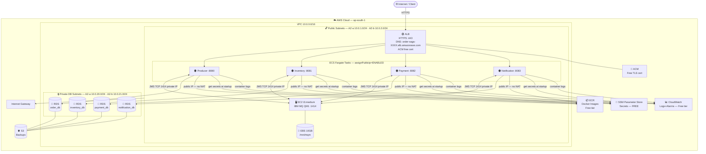

# Cost-Optimized Fargate + RDS Architecture
## IBM MQ Order Saga — No Route 53 · No NAT Gateway · Free Secrets

---

## Architecture Diagram


---

## What Changed vs. Previous Design

| Component | Before | Now | Monthly Saving |
|---|---|---|---|
| Route 53 | ✅ Included | ❌ Removed — use ALB DNS name directly | ~$0.60/mo |
| NAT Gateway | ✅ 2× ($32/mo each) | ❌ Removed — Fargate in public subnets | **~$64/mo** |
| Secrets Manager | ✅ Included ($0.40/secret) | ❌ Replaced by SSM Parameter Store | **~$2/mo** |
| **Total Saving** | | | **~$69/mo** |

---

## Secrets Manager vs. SSM Parameter Store — Full Comparison

| Feature | Secrets Manager | SSM Parameter Store (Standard) |
|---|---|---|
| **Cost per secret/parameter** | $0.40/month each | **FREE** |
| **API call cost** | $0.05 per 10,000 calls | **FREE** (standard tier) |
| **Encryption (SecureString)** | AES-256 via KMS | AES-256 via KMS (same!) |
| **ECS injection support** | ✅ Yes | ✅ Yes (same syntax) |
| **Automatic rotation** | ✅ Yes (built-in) | ❌ Manual only |
| **Cross-account sharing** | ✅ Yes | Limited |
| **Max parameter size** | 65,536 chars | 4,096 chars (standard) |
| **Suitable for POC?** | Overkill — you're paying for rotation you don't use | ✅ **Perfect** |

> **Verdict**: Use **SSM Parameter Store Standard tier** for POC.
> It encrypts secrets with the same KMS keys, integrates with ECS identically,
> and costs **$0**. Switch to Secrets Manager only when you need auto-rotation in production.

---

## Why No NAT Gateway is Safe (The Public Subnet Trick)

Placing Fargate tasks in public subnets with `assignPublicIp=ENABLED` means:

| What changes | Impact |
|---|---|
| Fargate tasks get a public IP | They can reach the internet directly (ECR image pulls, SSM API calls) |
| Security groups unchanged | Still block all unwanted inbound traffic |
| IBM MQ still reachable | EC2 in the same VPC — accessed via **private IP** (no internet hop) |
| RDS still reachable | Private DB subnets — accessed via **private IP** within VPC |
| **Risk** | Tasks are technically on a public subnet — but SG has no inbound rules for 1414, 5432, etc. |

> **Security trade-off**: This is completely acceptable for a POC. The security group
> is the actual firewall — subnet type (public vs private) is just about routing.
> For production, move Fargate back to private subnets + NAT or VPC Endpoints.

---

## Full Architecture



---

## VPC & Network Design

```
VPC: 10.0.0.0/16
│
├── AZ-a (ap-south-1a)
│    ├── Public Subnet:   10.0.1.0/24   [ALB, ECS Fargate tasks, EC2 IBM MQ]
│    └── Private Subnet:  10.0.20.0/24  [RDS Primary instances]
│
└── AZ-b (ap-south-1b)
     ├── Public Subnet:   10.0.2.0/24   [ALB (multi-AZ), ECS Fargate tasks]
     └── Private Subnet:  10.0.21.0/24  [RDS Standby / free tier: unused]

Internet Gateway: igw-poc (attached to VPC, handles all outbound for public subnets)
NO NAT Gateway — not needed since Fargate has public IPs
```

---

## Security Groups (Detailed)

### `sg-alb` — Application Load Balancer

| Direction | Protocol | Port | Source | Reason |
|---|---|---|---|---|
| Inbound | TCP | 443 | `0.0.0.0/0` | HTTPS from anywhere |
| Inbound | TCP | 80 | `0.0.0.0/0` | HTTP → redirect to 443 |
| Outbound | TCP | 8080–8083 | `sg-ecs-*` | Forward to ECS tasks |

### `sg-ecs-producer` — Producer ECS Task

| Direction | Protocol | Port | Source/Dest | Reason |
|---|---|---|---|---|
| Inbound | TCP | 8080 | `sg-alb` only | ALB health checks + routing |
| Outbound | TCP | 1414 | `sg-mq` | IBM MQ JMS |
| Outbound | TCP | 5432 | `sg-rds-producer` | order_db |
| Outbound | TCP | 443 | `0.0.0.0/0` | ECR image pull, SSM, CloudWatch APIs |

*(Repeat pattern for inventory/8081, payment/8082, notification/8083)*

### `sg-mq` — IBM MQ EC2

| Direction | Protocol | Port | Source | Reason |
|---|---|---|---|---|
| Inbound | TCP | 1414 | `sg-ecs-producer`, `sg-ecs-inventory`, `sg-ecs-payment`, `sg-ecs-notification` | JMS connections from all 4 services |
| Inbound | TCP | 9443 | `YOUR_IP/32` | Admin console (your IP only) |
| Inbound | TCP | 22 | `YOUR_IP/32` | SSH for troubleshooting |
| Outbound | TCP | 443 | `0.0.0.0/0` | Docker image pull (IBM MQ image from icr.io) |

### `sg-rds-producer` / `sg-rds-inventory` / `sg-rds-payment` / `sg-rds-notification`

| Direction | Protocol | Port | Source | Reason |
|---|---|---|---|---|
| Inbound | TCP | 5432 | Matching `sg-ecs-*` only | One service per database — strict isolation |
| Outbound | None | — | — | Databases don't initiate connections |

---

## SSM Parameter Store Setup (Free)

### Creating Parameters

```bash
# Store all secrets in SSM Parameter Store (Standard tier — FREE)
# SecureString type = encrypted with default AWS KMS key at no extra charge

aws ssm put-parameter \
  --name "/order-saga/POSTGRES_USER" \
  --value "postgres" \
  --type "SecureString" \
  --region ap-south-1

aws ssm put-parameter \
  --name "/order-saga/POSTGRES_PASSWORD" \
  --value "YourSecurePassword123!" \
  --type "SecureString" \
  --region ap-south-1

aws ssm put-parameter \
  --name "/order-saga/MQ_USER" \
  --value "app" \
  --type "String" \
  --region ap-south-1

aws ssm put-parameter \
  --name "/order-saga/MQ_PASSWORD" \
  --value "YourMQPassword123!" \
  --type "SecureString" \
  --region ap-south-1

aws ssm put-parameter \
  --name "/order-saga/MQ_ADMIN_PASSWORD" \
  --value "YourAdminPassword123!" \
  --type "SecureString" \
  --region ap-south-1
```

### Injecting SSM Parameters into ECS Task Definition

```json
{
  "family": "order-producer-service",
  "containerDefinitions": [
    {
      "name": "order-producer-service",
      "image": "ACCOUNT.dkr.ecr.ap-south-1.amazonaws.com/order-producer-service:latest",
      "environment": [
        { "name": "MQ_HOST",  "value": "10.0.1.XXX" },
        { "name": "DB_HOST",  "value": "order-db.XXXX.ap-south-1.rds.amazonaws.com" },
        { "name": "DB_PORT",  "value": "5432" }
      ],
      "secrets": [
        {
          "name": "POSTGRES_USER",
          "valueFrom": "arn:aws:ssm:ap-south-1:ACCOUNT:parameter/order-saga/POSTGRES_USER"
        },
        {
          "name": "POSTGRES_PASSWORD",
          "valueFrom": "arn:aws:ssm:ap-south-1:ACCOUNT:parameter/order-saga/POSTGRES_PASSWORD"
        },
        {
          "name": "MQ_USER",
          "valueFrom": "arn:aws:ssm:ap-south-1:ACCOUNT:parameter/order-saga/MQ_USER"
        },
        {
          "name": "MQ_PASSWORD",
          "valueFrom": "arn:aws:ssm:ap-south-1:ACCOUNT:parameter/order-saga/MQ_PASSWORD"
        }
      ]
    }
  ]
}
```

> The `secrets` block works identically whether you use SSM Parameter Store or
> Secrets Manager — only the ARN prefix changes (`ssm` vs `secretsmanager`).
> ECS injects them as environment variables at task startup. Zero application
> code changes required.

### IAM Permission for ECS Task Execution Role (SSM access)

```json
{
  "Version": "2012-10-17",
  "Statement": [
    {
      "Effect": "Allow",
      "Action": [
        "ssm:GetParameters",
        "ssm:GetParameter"
      ],
      "Resource": "arn:aws:ssm:ap-south-1:ACCOUNT:parameter/order-saga/*"
    },
    {
      "Effect": "Allow",
      "Action": "kms:Decrypt",
      "Resource": "arn:aws:kms:ap-south-1:ACCOUNT:key/aws/ssm"
    }
  ]
}
```

---

## ALB Without Route 53

You don't need Route 53. Use the ALB's auto-generated DNS name directly:

```
ALB DNS (auto-assigned, free):
  order-saga-1234567890.ap-south-1.elb.amazonaws.com

Test your API:
  curl https://order-saga-1234567890.ap-south-1.elb.amazonaws.com/api/producer/health

ACM Certificate:
  Request a free cert for the ALB in ACM — works with the ALB DNS name
  (use *.ap-south-1.elb.amazonaws.com wildcard or your own domain if you have one)
```

> If you have a custom domain (even free ones like `.me` or `.dev`), you can point
> your DNS A record to the ALB without using Route 53 — use whatever DNS registrar you have.
> Route 53 is only needed if you want AWS to manage your DNS zone.

---

## Revised Cost Breakdown

| AWS Service | Purpose | Daily | Monthly | Notes |
|---|---|---|---|---|
| **ECS Fargate** | 4 tasks: 2×(0.5vCPU/1GB) + 2×(0.25vCPU/0.5GB) | ~$1.70 | **~$51** | 24/7 |
| **EC2 t3.medium** | IBM MQ broker | ~$1.04 | **~$30** | 1-yr reserved → ~$18/mo |
| **EBS gp3 30 GB** | Root + MQ persistence | ~$0.08 | **~$2.40** | Encrypted |
| **RDS t3.micro × 4** | 4 databases, 20 GB each | ~$2.00 | **~$60** | No Multi-AZ; backups included |
| **ALB** | HTTPS ingress + routing | ~$0.53 | **~$16** | Covers 4 services |
| **ACM Certificate** | Free TLS on ALB | $0 | **$0** | Free on AWS resources |
| **ECR** | Docker image registry | $0 | **$0** | Free tier: 500 MB/repo |
| **SSM Parameter Store** | All secrets (5 params) | $0 | **$0** | Standard tier is FREE |
| **CloudWatch Logs** | Container logs (4 services) | $0 | **$0** | Free tier: 5 GB/mo |
| **CloudWatch Alarms** | CPU, memory, RDS alerts | $0 | **$0** | Free tier: 10 alarms |
| **SNS** | Email alerts | $0 | **$0** | Free tier: 1k emails/mo |
| **S3** | RDS backup archive | ~$0.001 | **~$0.02** | Minimal data |
| **VPC, IGW, SG, IAM** | Networking + security | $0 | **$0** | Always free |
| **Route 53** | DNS | ❌ Not used | **$0** | Use ALB DNS directly |
| **NAT Gateway** | Outbound internet | ❌ Not used | **$0** | Fargate in public subnet |
| **Secrets Manager** | Secrets | ❌ Not used | **$0** | Replaced by SSM |
| | | | | |
| **TOTAL** | | **~$5.35/day** | **~$160/mo** | |

### Savings vs. Previous Design

| Item Removed | Monthly Saving |
|---|---|
| 2× NAT Gateways | **-$64/mo** |
| Route 53 hosted zone | **-$0.60/mo** |
| Secrets Manager (5 secrets) | **-$2/mo** |
| **Total Saving** | **-$66.60/mo** |
| **New Total** | **~$160/mo** |

### Further Optional Savings

| Option | Additional Saving | Trade-off |
|---|---|---|
| EC2 Reserved Instance (1yr, No Upfront) | -$12/mo | Commit to 1 year |
| Fargate Spot for Inventory + Notification | -$10/mo | Tasks may be interrupted (acceptable for workers) |
| Stop EC2 IBM MQ when not demoing | -$15/mo | Manual start/stop required |
| **Best case total** | **~$123/mo** | |

---

## Security Trade-off: Public Subnet Fargate

> **Q: Is it safe to run Fargate in a public subnet?**

Yes — for a POC. Here's why:

| Concern | Reality |
|---|---|
| "Tasks are publicly accessible" | Only ports explicitly allowed in the security group are reachable. `sg-ecs-producer` allows inbound only from `sg-alb` on port 8080. Nothing else. |
| "Public IP is risky" | The public IP is only used for **outbound** traffic (ECR image pulls, SSM API calls). Inbound is still security-group–controlled. |
| "Database is exposed" | RDS is in a **private subnet** with no internet route. Fargate reaches it via private VPC IP. |
| "IBM MQ is exposed" | `sg-mq` has no inbound rule for port 1414 from `0.0.0.0/0`. Only `sg-ecs-*` can reach it. |
| **Production recommendation** | Move Fargate to private subnets + add VPC Endpoints for ECR/SSM/CloudWatch. Costs ~$21/mo in endpoint fees but eliminates all public IPs for tasks. |

---

## Quick Reference

### ALB Listener Rules

```
Listener: HTTPS :443
  Rule 1: Path /api/producer/*   → Target Group: ecs-producer:8080
  Rule 2: Path /api/inventory/*  → Target Group: ecs-inventory:8081
  Rule 3: Path /api/payment/*    → Target Group: ecs-payment:8082
  Rule 4: Path /api/notification/* → Target Group: ecs-notification:8083
  Default: 404
```

### ECS Service Config (same for all 4)

```
Launch Type:     FARGATE
Subnets:         public-subnet-a, public-subnet-b
Assign Public IP: ENABLED   ← KEY setting that removes NAT dependency
Desired Count:   1
Min Healthy %:   0    (allows stop-then-start rolling update)
Max %:           200
```

### IBM MQ Access from Fargate

IBM MQ EC2 is in the same VPC (same public subnet or different subnet — doesn't matter).
Fargate tasks connect to IBM MQ using its **private IP address** (e.g., `10.0.1.50`).
No internet hop occurs — traffic stays within the VPC.

```properties
# In ECS task definition environment variables:
MQ_HOST=10.0.1.50    ← private IP of IBM MQ EC2 instance
```

Or use the EC2's **private DNS name**:
```properties
MQ_HOST=ip-10-0-1-50.ap-south-1.compute.internal
```

---

## Summary Card

```
┌────────────────────────────────────────────────────────────────┐
│         COST-OPTIMIZED FARGATE + RDS ARCHITECTURE              │
│                                                                  │
│  Client → ALB (DNS name, no Route 53) → 4× ECS Fargate        │
│             [public subnet, assignPublicIp=ENABLED]              │
│                          ↕ JMS (private IP)                      │
│                    EC2 IBM MQ (EBS /mnt/mqm)                    │
│                          ↓                                       │
│             4× RDS PostgreSQL (private subnet)                   │
│                                                                  │
│  SECRETS:   SSM Parameter Store Standard = FREE                 │
│  DNS:       ALB auto-generated DNS name = FREE                  │
│  INTERNET:  No NAT Gateway = SAVES $64/mo                       │
│                                                                  │
│  MONTHLY COST:  ~$160/mo   (was $226/mo — saved $66/mo)        │
│  DAILY COST:    ~$5.35/day                                      │
└────────────────────────────────────────────────────────────────┘
```

---

*All decisions based on actual codebase analysis. No assumptions made without statement.*
